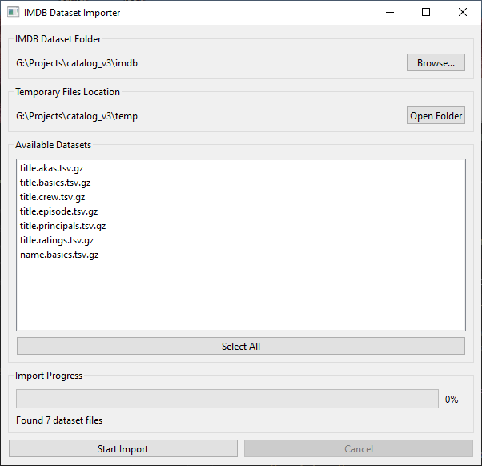
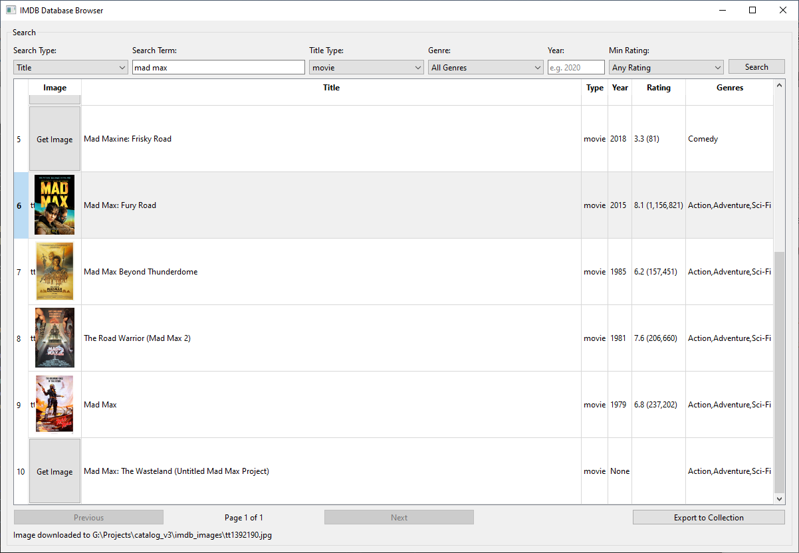

# IMDB DB Tools

This project allows you to run a copy of the IMDB.com movie and tv show database on your computer.
It consists of two steps:
1- Downloading the data from IMDB
2- Importing the data
3- Running the DB browser to search

A Python-based toolkit for importing and managing IMDB TSV datasets locally. This project consists of two main components: a dataset importer and a database browser.

To use this project you will need to already have or download the IMDB TSV files.

IMDB offers daily archives of their database which they provide in TSV format.
[IMDB TSV Archive](https://datasets.imdbws.com/)

*In order to use this project, you must have these TSV files in the imdb subfolder of the project OR already imported them and have the database created and filled*




## Features

### IMDB Dataset Importer (`tsv_import.py`)
- **User-friendly GUI** for importing IMDB dataset files
- **Efficient Data Processing**:
  - Handles large TSV files with memory-efficient batch processing
  - Maintains extracted files for faster subsequent imports
  - Progress tracking with detailed status updates
- **Flexible Import Options**:
  - Create new database or append to existing one
  - Selective import of specific dataset files
  - Automatic table creation with appropriate column types
  - Optimized with indexes for better query performance
- **Supported Datasets**:
  - title.akas.tsv.gz (Alternative titles)
  - title.basics.tsv.gz (Basic title information)
  - title.crew.tsv.gz (Director and writer information)
  - title.episode.tsv.gz (TV episode information)
  - title.principals.tsv.gz (Principal cast/crew)
  - title.ratings.tsv.gz (Title ratings)
  - name.basics.tsv.gz (Name information)

### IMDB Browser
- Search and browse your local IMDB database
- Download and manage cover images
- View detailed information about movies and TV shows

## Requirements

- 24gigabytes of space for the database minimum (currently its nearing 23gb in size so a bit of room there)
- Cover image storage is only limited by the storage available on the system as you have manual control over downloading each image.

- Python 3.x
- PyQt6
- SQLite3

## Installation

1. Clone this repository:
```bash
git clone [repository-url]
cd imdb_db
```

2. Install required packages:
```bash
pip install PyQt6
```

3. Download IMDB datasets from [IMDB's website](https://www.imdb.com/interfaces/) and place them in an `imdb` folder in the project directory.

## Usage

### Importing Data

1. Run the importer:
```bash
python tsv_import.py
```

2. Use the GUI to:
   - Select your IMDB dataset folder
   - Choose which datasets to import
   - Start the import process
   - Monitor progress and status

The importer will:
- Create or update the SQLite database (`imdb.db`)
- Extract and process the gzipped TSV files
- Create optimized database tables with appropriate indexes

### Browsing Data

Run the browser:
```bash
python imdb_browser.py
```

## Database Structure

The database follows IMDB's data structure with the following main tables:

- **title_basics**: Core information about titles
- **title_akas**: Alternative title names
- **title_crew**: Directors and writers
- **title_episode**: TV episode information
- **title_principals**: Principal cast/crew
- **title_ratings**: User ratings
- **name_basics**: Information about people (actors, directors, etc.)

## Performance Considerations

- The importer uses batch processing to handle large datasets efficiently
- Extracted TSV files are preserved in a temp directory for faster subsequent imports
- Database indexes are created after data import for optimal query performance
- The browser may take a minute to load initially due to database size (22gigs+)

## Contributing

Contributions are welcome! Please feel free to submit a Pull Request.

## License

[MIT License]

## Acknowledgments

- IMDB for providing the datasets
- PyQt team for the GUI framework
- All contributors to this project 
