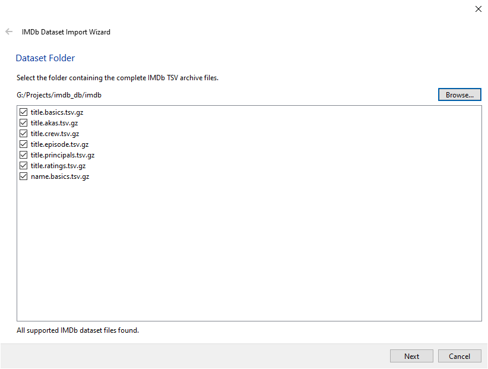
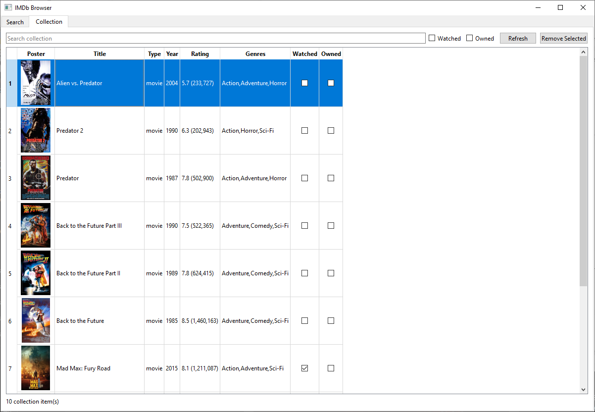

# IMDb DB Tools

A desktop tool for importing IMDb's public datasets into SQLite, searching titles locally, and managing a personal movie/show collection.

## Features

- Guided import wizard for IMDb TSV files
- Local SQLite database browser
- Search by title, type, genre, year, and rating
- Personal collection with watched and owned status
- Poster downloads from IMDb using headless Chromium
- Optional TMDB support for missing descriptions
- Optional IMDb plot scraping when a description is missing




## Requirements

- Python 3.10 or newer
- The packages listed in `requirements.txt`
- The IMDb dataset files from [datasets.imdbws.com](https://datasets.imdbws.com/)
- Enough free disk space for the imported database (at least 24gb) and poster images

Install Python dependencies:

```bash
pip install -r requirements.txt
```

After the requirements finish installing, install Playwright's browser dependencies:

```bash
playwright install
```

## IMDb Dataset

Download the IMDb dataset files from:

[https://datasets.imdbws.com/](https://datasets.imdbws.com/)

The importer expects these files:

- `title.basics.tsv.gz`
- `title.akas.tsv.gz`
- `title.crew.tsv.gz`
- `title.episode.tsv.gz`
- `title.principals.tsv.gz`
- `title.ratings.tsv.gz`
- `name.basics.tsv.gz`

Keep the files compressed. The importer reads the `.tsv.gz` files directly.

## Importing

Start the importer:

```bash
python importer.py
```

The wizard will:

- Ask for the folder containing the IMDb dataset files
- Validate that the required files are present
- Create or replace `imdb.db`
- Import rows in batches and commit progress throughout the import
- Show the current file, current step, row counts, database size, and log output
- Build indexes after the data import completes

The import can take a long time. Leave the wizard open until it finishes. When the import is complete, the app displays a completion message.

## Browsing

Start the browser:

```bash
python browser.py
```

Use the Search tab to find IMDb titles. Double-click a title to open its details. Poster downloads and missing descriptions are fetched only when needed.

## Collection

The Collection tab is your personal library. It is stored in `media_collection.db`, separate from the imported IMDb data.

Collection entries support:

- Watched and owned checkboxes
- Poster images
- Saved descriptions
- Ratings, votes, genres, title type, and year

Use **Add Selected** from the Search tab to add a title. The Collection tab updates automatically after an item is added.

## Descriptions

Descriptions are only fetched when a title does not already have one saved.

TMDB can be used for missing descriptions. Create a free TMDB account and API key at:

[https://www.themoviedb.org/](https://www.themoviedb.org/)

IMDb plot scraping can also be enabled for titles where TMDB does not have a description.

## Posters

Poster downloads use headless Chromium to load IMDb pages, follow the poster media-viewer link, and save the poster image locally under the configured image folder.

If poster downloads fail, confirm Chromium is installed:

```bash
playwright install
```

